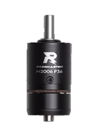

# RM电控入门 1：从认识 RoboMaster 机器人开始

一台最基础的 RoboMaster 步兵机器人会包含以下结构:

- **底盘**：机器人的移动机构，通常由4个特殊结构轮组（如麦克纳姆轮、全向轮、舵轮等）组成，配合无刷电机实现全向移动。电控组的职责是控制底盘电机的速度与方向，使其按照策略组或手动遥控指令稳定运行。
- **云台**：云台通常由两个电机组成 —— Pitch 轴（俯仰）和 Yaw 轴（左右旋转），用于控制枪口方向，实现目标跟踪和瞄准。控制精度要求高，是连接视觉组自瞄与射击模块的关键中间环节。
- **发射机构**：发射机构是实现“攻击”的核心组件，包括摩擦轮与拨弹轮，分别用于提供弹丸发射动能和弹丸推进控制。
- **裁判系统**：裁判系统由大疆在赛前提供，负责与官方比赛规则接轨，接收击打数据、生命值、弹药信息等，是比赛信息交互的核心桥梁。
- **主控板**：电控板是整个机器人的控制中心之一，通常基于 STM32 等 MCU 自主开发，承担与各模块通信、状态管理、动作指令下发等职责，是整车“控制中枢”。

对于电控组而言，我们在开发过程中会使用到以下硬件

| 名称 | 用途 | 参考图片 |
|:---:|---|:---:|
|主控板|MCU单片机，作为机器人的下位机，用于整车控制，在本赛季使用的主控板（C板）中内含陀螺仪（IMU）||
|分电板|相当于一个供电和信号的“分流装置”，内部为并联电路，将单个输入转换为多个相同值输出的接口||
|GM6020电机|云台Yaw轴、Pitch轴动力源||
|M2006电机、C610电调|拨弹装置动力| |
|M3508电机、C620电调|轮组动力、摩擦轮动力、大弹丸拨弹装置| |
|DBUS遥控器、接收机|提供遥控控制输入||
|MiniPC（小电脑）|视觉算法运算处理单元，作为机器人上位机运行复杂算法||
|工业相机|视觉图像采集单元||

电控组的日常开发主要基于主控板，通过主控板发出的CAN信号控制各个部位的电机，这些部分在后续会有详细介绍，在此就不多赘述了。电机控制的供电和信号传输路径如下图所示：

---
END